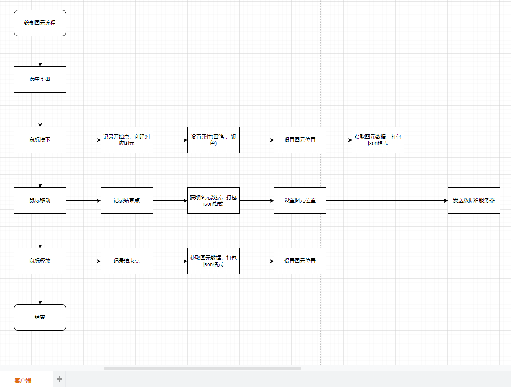
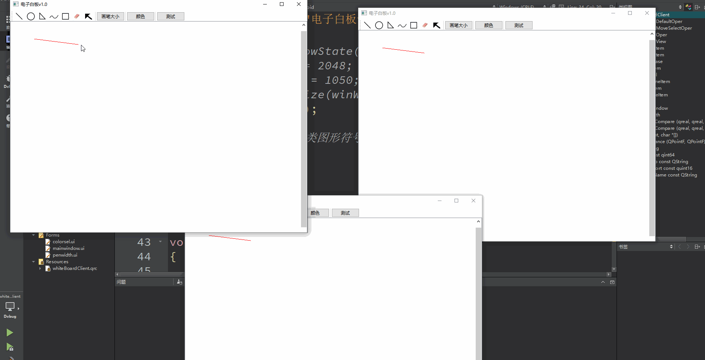

# WhiteBoard

```
名称：电子白板v1.0
	 基于 Qt6.3.2 
     代码归档
```

### 1.功能

+ 绘制直线 三角形 圆形 矩形 
+ 自由绘制 
+ 橡皮擦
+ 设置颜色和画笔宽度
+ 客户端同步绘制

流程图



**演示：**




### 待优化

- [ ] 界面美化

- [ ] 画笔和颜色同步

- [ ] 图元可编辑 (旋转 缩小 删除)

- [ ] 可透明背景

- [ ] 导出pdf 图片

- [ ] 支持录音

  

